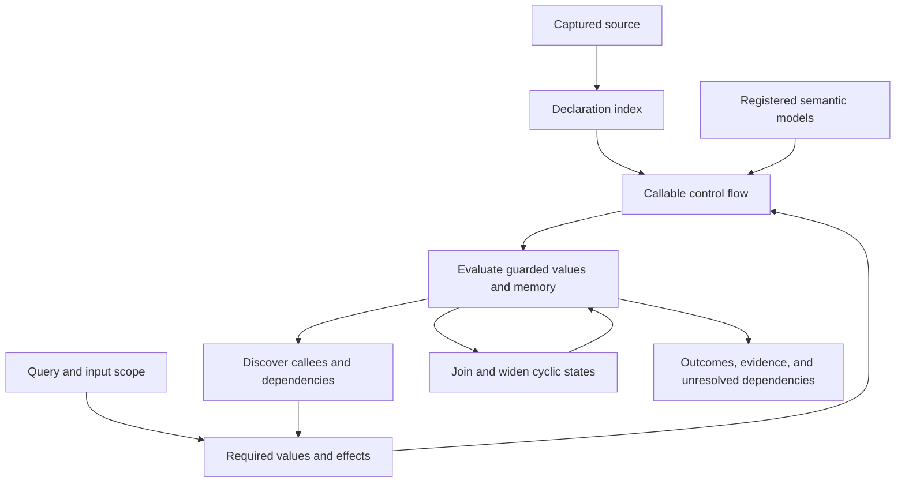

# How derivation works

Deriver derives the possible values and states at a selected observation point. It reads application source as data. It evaluates a representation of that source using symbolic values, reference cells, and object identities; it does not include application files or execute their autoloaders.

## From a question to an answer

1. **Capture source and declarations.** Opening a session copies source bytes, parses declarations, resolves names, and records configuration and model versions. The session identifies one immutable snapshot. Capturing declarations does not evaluate every function body.
2. **Identify the question.** A return query selects a callable. A value or state query selects a source observation. Symbolic scope considers valid parameter inputs; entrypoint scope supplies explicit calls and input values. A tuple query keeps related observations together.
3. **Build the required control flow.** The selected callable is converted into basic blocks and explicit instructions. Expression registers identify evaluated values. Separate address instructions identify storage. Branches, calls, returns, exceptions, and finally blocks preserve their execution order. Registered model plans compile to the same instruction representation.
4. **Discover dependencies backward.** A worklist follows definitions used by demanded registers, arguments, and branch or completion operands. Potential writes, calls, warnings, and exceptions are also roots. The current implementation deliberately retains these possible effects broadly: it eliminates unused inert definitions, but does not promise a minimal slice for every requested field.
5. **Evaluate forward.** Each feasible path carries its condition, values, and memory together. Known operations compute constants or structured symbolic expressions. Reads and writes distinguish value copies, shared reference cells, and shared objects. Callee arguments are bound using the same rules for source and model bodies. New calls add dependencies as targets become available.
6. **Resolve cycles or retain a boundary.** Known finite iterations can be evaluated directly. General cycles use inclusion checks, joins, and widening; mutually dependent calls are tracked together. If an operation is unsupported or a budget stops the work, the result retains its unresolved dependency and reason. An unfinished computation is never treated as an empty successful answer.
7. **Collect the requested outcomes.** Normal and exceptional outcomes retain their conditions and storage. Assessment reports closure, precision, and correlation separately. A symbolic expression can be complete even though it is not a constant.

For example, a query for `return 'user:' . $id` in symbolic scope produces a concatenation with the parameter `id`. With an explicit entry argument of `42`, it produces `user:42`. A question about an argument containing `$id++` observes the argument's already evaluated value, while a subsequent state observation sees the incremented storage.

## Core concepts and their responsibilities

| Concept | Responsibility | Package location |
| --- | --- | --- |
| Project | Captured files, target semantics, configuration, and snapshot identity | `Project` |
| Source | Syntax trees, declaration indexing, validation, and conversion into control flow | `Source` |
| Control flow | Parser-independent callable graphs, blocks, instructions, and completion targets | `ControlFlow` |
| Evaluation | Call binding, instruction evaluation, demand dependencies, summaries, and convergence | `Evaluation` |
| Memory | Storage locations, reference cells, shared objects, and storage snapshots | `Memory` |
| Value and constraint | Symbolic terms, value operations, inclusion, and feasible conditions | `Value`, `Constraint` |
| Model | Signatures, semantic plans, providers, domain contracts, registration, and built-in function semantics | `Model` |
| Query and reference | The requested observation, input scope, budget, and snapshot-bound references | `Query`, `Reference` |
| Result | Guarded outcomes, evidence, unresolved dependencies, assessment, and optional JSON serialization | `Result` |
| Analysis session | Coordinates captured inputs and queries, and reuses valid cached work | `Analyzer`, `AnalysisSession`, `Analysis` |

Visibility is documented on the classes rather than encoded by an `Api` or `Internal` directory. `Source/Declaration`, `Source/Compilation`, and `Source/Validation` separate indexing, graph construction, and source checks. `Model/Registration`, `Model/Compilation`, `Model/Domain`, and `Model/Intrinsic` separate registration policy, plan compilation, domain laws, and pure operations.

## Reuse and limits

An analyzer reuses bounded source and compiled graph caches across its sessions. A session can reuse a completed identical query result. Completed call-outcome memoization requires a proven isolated computation; stateful calls reuse their graph and evaluate effects in the current memory. Neither a warm cache nor a previously seen call bypasses the current query's semantic assumptions or work limits.

The dependency search and evaluator cooperate, but their current implementation is conservative about effects. This can increase work or leave a broader unresolved dependency than an application-specific analysis. See [the capability manifest](capabilities.md) for supported operations and [the semantic contract](design.md) for the guarantees used to interpret a result.

## Failures have separate meanings

- An exception in the analyzed application is an exceptional outcome, including effects completed before the throw.
- An unsupported operation or interrupted analysis is an unresolved dependency in the result.
- A model that returns an invalid plan or domain fact raises `ModelContractException` in the host process.
- An exception thrown by trusted extension code propagates unchanged to the host caller. A source-level `catch` cannot catch a failure in the analyzer or its extensions.

The optional [JSON Schema](json.md#when-the-schema-is-used) describes serialized results. It does not participate in dependency discovery, evaluation, or memory analysis.
