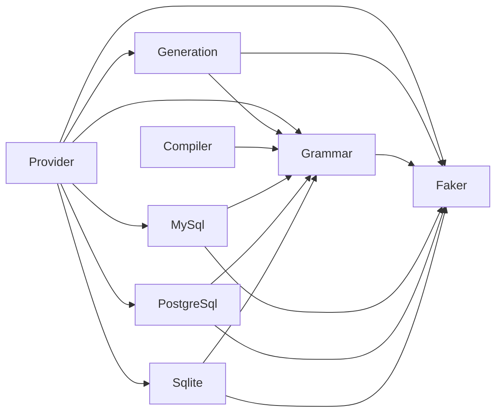

# Contributing to SQL Faker

Run development commands from `packages/sql-faker` in the repository checkout.

## Documentation audiences

`README.md` introduces SQL Faker with requirements, installation, a short example,
and links to the user documentation. `docs/` is the product documentation for
people using the library: document supported operations, arguments, output,
versions, errors, and realistic usage examples there.

Keep repository architecture, tool configuration, CI, test execution, visibility
annotations, and maintenance instructions in this contributing guide. An API
reference should explain how to call the library and interpret its results.

## Development commands

```sh
composer install
composer test
composer lint
composer format
```

`composer test:unit` selects only unit tests. `composer bench` runs benchmarks;
`composer infection` runs mutation testing. `composer fuzz` runs the dialect fuzz
targets, which use database containers for syntax checks.

Regenerate dialect grammar and lexical resources with `composer build-mysql`,
`composer build-pg`, and `composer build-sqlite`. These commands retrieve upstream
lexer sources; parsing them requires no compiler or database server.

## SQL generation architecture

Every dialect compiles to `SqlFaker\Grammar\Grammar`, using shared
`ProductionRule`, `Production`, `Terminal`, and `NonTerminal` types.

A provider resolves its release, loads its grammar, and delegates construction to
`SqlFaker\Provider\SqlGeneratorFactory`. The factory builds a dialect
`GenerationContext` containing the grammar, lexical implementation, and any
parser-semantic or version-specific callbacks, then passes those collaborators to
`SqlFaker\Generation\SqlGenerator`. Provider methods describe each request with
a `GenerationPlan`; the generator derives and realizes that request.



| Layer | Responsibility | Allowed dependencies |
| --- | --- | --- |
| Provider | Stable Faker entry points and composition | Generation, Grammar, individual dialects, Faker |
| Generation | Derivation and lexical retries for any common AST | Grammar, Faker |
| Grammar | Shared symbol model, generation plans, termination analysis, lexical contracts and artifact support | Faker |
| MySql / PostgreSql / Sqlite | Release loading, plans, grammar adaptations, lexer realization and parser semantics | Grammar, Faker |
| Compiler | Parse Bison or Lemon source into the common model | Grammar |

The dialect layers cannot depend on one another, the common engine, or Provider.
Generation and Grammar cannot depend on a dialect or compiler. Bison belongs to
Compiler because both MySQL and PostgreSQL use that grammar format.
Lemon belongs there for the same reason: source syntax is a compilation concern.

`GenerationPlan::withStepBudget()` reserves enough expansions to finish the
remaining sentential form and prefers fewer expansions at the depth limit. SQLite
plans enable it. Other plans use shortest-output selection. The generation plan
chooses this policy.
SQLite's implicit terminals are resolved during grammar adaptation, so the common
derivation can reject undeclared nonterminals consistently.

The `bin/build-*.php` commands compose each dialect's profile builder with the
shared compiler, `Grammar\Lexical\LexicalProfileCheck`, and
`Grammar\Lexical\LexicalProfileWriter`.
The profile check validates the release identity and terminal coverage before the
writer publishes the grammar and profile.

## Dependency checks

Deptrac is configured using
[k-kinzal/php-ai-toolkit's setup-toolkit-deptrac skill](https://github.com/k-kinzal/php-ai-toolkit/blob/main/skills/setup-toolkit-deptrac/SKILL.md).
The toolkit supplies the setup workflow; the installed `vendor/bin/deptrac` is the
execution entry point. The package uses Deptrac 3 with its PHP 8.1 development
platform setting.

Run `composer deptrac` for dependency analysis and production-token assignment
checks, or `composer deptrac:debug` for assignment and unused-rule diagnostics.
`composer lint` includes Deptrac, so the lint CI job enforces the rules.

Deptrac 3 reports imported PHPStan type aliases and PHP `class_alias` names as
uncovered dependencies, even though they do not declare classes. Consequently,
coverage of production classes is enforced with `debug:unassigned`, rather than
`--fail-on-uncovered`. Actual forbidden dependencies still fail `analyse`, and a
new production class outside the defined layers fails `debug:unassigned`.

## Running examples

```sh
composer test
composer doctest
vendor/bin/phpunit --testsuite doctest --no-extensions
vendor/bin/phpunit --testsuite doctest --filter 'Choose a supported database version'
```

`composer test` selects all configured suites through ParaTest. `composer test:unit`
continues to select unit tests only. Mutation testing deliberately selects the
unit suite; the normal CI PHP 8.1–8.5 test matrix executes documentation examples
alongside it. There is no separate doctest CI job or chained duplicate execution.
The toolkit's AI PHPUnit reporter remains enabled.

`phpunit.xml.dist` registers the installed
`Toolkit\Doctest\DoctestExtension`, scans the production `src` root, and loads
`vendor/k-kinzal/php-ai-toolkit/src/Doctest/DoctestSuite.php` directly. No custom
bootstrap is needed: Composer also autoloads the three `StatementType` aliases.

The current toolkit source scanner handles classes and methods but does not
collect enum declarations or enum cases. `tests/Doctest/EnumExamplesTest.php`
supplies only those statement-enum PHPDocs to the toolkit's own `ExampleExtractor`
and `ExampleExecutor`. It uses the source AST to retain the declaration's location,
names each example, and fails if an enum or case lacks executable documentation.
It runs in the same doctest suite, including with extensions disabled. Remove this
bridge when the installed toolkit suite collects both enums and their cases.

## Enforcing documentation and access

The existing toolkit PHPStan extension enables both `RequireExampleOnPublicApiRule`
and `EnforceVisibilityScopeRule`; neither is disabled or baselined. Public intent
is explicit on individual declarations, including methods and enum cases. An
inline-only `@example description` does not satisfy the example rule: code must
appear on indented following lines or in an executable PHP fence.

The visibility rule checks written class references inside PHPStan's analysed
paths, with the configured namespace exemptions. It is static analysis, not PHP
runtime access control. For example, a consumer namespace in those paths may
reference `MySqlProvider`, but cannot reference `Provider\SqlGeneratorFactory`.

Provider PHPDoc includes executable examples. Its LocGuard policy allows 1,100 physical file lines and 1,050 physical class lines, while
retaining the existing 350 code-line limit, 10-line method limit and complexity
limit of 1.
