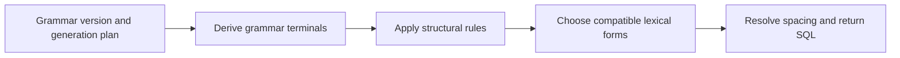

# SQL generation algorithm

SQL Faker generates SQL by deriving statements and fragments from a selected database grammar. MySQL uses its official Bison grammar (`sql_yacc.yy`), PostgreSQL uses its Bison grammar (`gram.y`), and SQLite uses its Lemon grammar (`parse.y`). The selected version also determines the lexical forms and structural rules used to produce SQL text. See the [supported versions](../README.md#support-syntax).

Both the [Faker interface](faker.md) and the [SqlGenerator interface](generator.md) accept [generation plans](plan.md), which select the starting rule, production constraints, token choices, and complexity settings.

## Generation process

1. **Choose a starting rule.** A plan selects a statement, a fragment such as an expression, or the grammar's own entry point. Explicit rule names may be resolved to release-specific aliases.
2. **Derive terminals.** SQL Faker repeatedly expands the leftmost non-terminal. It applies occurrence-specific production patterns and excludes alternatives that cannot terminate or fit within the remaining expansion budget. Completion analysis considers descendant and repeated-occurrence constraints, including the requirement for non-empty output. Eligible alternatives are chosen using Faker until the complexity threshold is reached.
3. **Apply structural rules.** Dialect-specific rules transform the derived token sequence to account for parser constraints that the grammar alone does not express. Original production choices and the transformed sequence remain distinguishable in the generator's diagnostics.
4. **Choose lexical forms.** Terminals are realized from right to left. Each terminal offers candidate spellings or values with spacing requirements. SQL Faker selects a candidate compatible with the resolved suffix and the outstanding requirements to its left. Requested spellings and candidate keys further restrict this selection.
5. **Serialize the result.** Once token boundaries are resolved, their text and separators are concatenated. The final result must be non-empty when the plan requires it.

Generation makes one pass through these stages. It does not retry complete SQL statements, repair finished SQL, or re-tokenize the completed string as an acceptance check. If a selected terminal has no compatible lexical realization, generation fails; the grammar walk does not hide missing lexical support by removing that grammar alternative.

Lexical plans, such as `GenerationPlans::stringLiteral(1, 20)`, use a separate path that constructs a single lexical value directly from its parameters. They do not walk statement grammar or run the structural and boundary-selection stages above.

## Complexity and termination

`maxDepth` is a threshold on the total number of non-terminal expansions. It does not measure nesting depth. Its minimum effective value is `1`, so `maxDepth: 0` also selects the shortest alternatives immediately.

Once the expansion count reaches the threshold, ordinary plans prefer the smallest estimated terminal count. Plans using `withStepBudget()` first prefer fewer remaining expansions, then fewer terminals. SQLite's provider plans apply that preference. Regardless of this preference, generation checks that the remaining form can complete within its expansion budget.

The default expansion budget is 5,000. `withExpansionBudget($budget)` sets an explicit positive limit, independently of `maxDepth`. A plan that cannot complete within that budget raises `GenerationException`. A larger budget can permit larger derivations and more expensive completion analysis; it is not a time or memory limit.

Lower depth thresholds favor shorter derivations. They do not fix the SQL length, the number of clauses, or the number of nested queries. The default `PHP_INT_MAX` postpones the shortening preference but does not remove the expansion budget. The shortest choices can consistently prefer the first equally short alternative, reducing variety.

## Reproducibility

Construct the provider or generator before seeding Faker, then repeat the same calls with the same arguments. Keep the SQL Faker, FakerPHP, database grammar, and runtime versions fixed when reproducing a result. Other Faker calls or PHP random-number calls can change subsequent output.

For explicit replay of production and lexical choices, a [compiled generation plan](plan.md#compiling-replayable-plans) records the chosen alternatives, spellings, and candidate identities. It is tied to the grammar and generation definitions used to compile it; it is not a portable SQL representation or a compatibility promise across upgrades.

## Limitations

| Area | What to expect |
|------|----------------|
| Execution and semantics | SQL Faker does not inspect a database schema or execute SQL. Table and column names, types, function arguments, constraints, privileges, and server state may be incompatible. Syntactically accepted SQL can still fail during execution. |
| Server acceptance | Grammar derivation, structural rules, and lexical boundary rules model SQL syntax, but generation does not ask the database server to parse the result. Parser semantic actions, SQL modes, extensions, and build options may impose additional restrictions. |
| Syntax coverage | The bundled grammar, selected version, structural transformations, and plan determine the reachable syntax. Supported version tags do not mean exhaustive coverage of all server configurations. An absent lexical candidate remains a generation error. |
| Distribution | Random choices occur at individual grammar rules and lexical candidate sets. Complete statements are not sampled uniformly, and repeated calls do not guarantee coverage of every SQL form. |
| Fragments and statement counts | Optional rules can return empty strings, and general entry points can produce multiple statements or command forms. Some named rules produce only fragments. Check the dialect notes in the [Faker](faker.md) and [generator](generator.md) references. |
| Names and values | Identifiers and values are not schema-aware fixture data. They need not be unique or consistent across a statement. A lexical helper generates a new value; it does not quote an application-supplied value. |
| Lexical parameters | Length and numeric bounds control construction, not database validation. Direct lexical helpers can produce a form unsupported by the selected server version or outside its accepted value range. They do not cover every escaping, Unicode, or numeric boundary case. |
| Constraints | Patterns restrict a rule when it is visited; they do not require that rule to be reached or express relationships between tables and columns. Lexeme requests must match an available candidate or value domain and its boundary constraints. |
| Resource limits and failures | An unknown rule, contradictory constraints, an insufficient expansion budget, or incompatible lexical candidates can raise an exception. Raising the budget cannot repair a contradiction or guarantee successful execution. |

If a test requires successful execution, provide the necessary schema and state and validate the generated statement against the target database.
