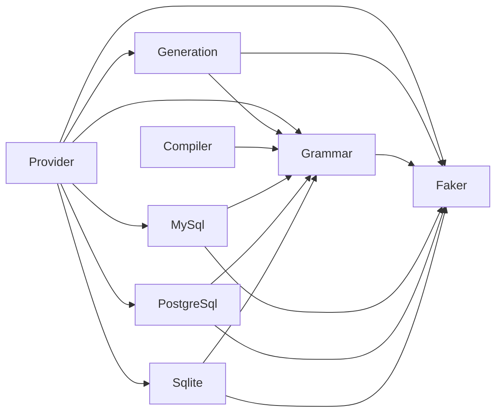

# SQL generation architecture

Every dialect compiles to `SqlFaker\Grammar\Grammar`, containing the same
`ProductionRule`, `Production`, `Terminal` and `NonTerminal` types. The serialized
MySQL artifacts use this model too. No runtime conversion of a second AST is
needed by a Provider.

A public Provider resolves its release and creates a dialect `GenerationContext`.
That context prepares the common grammar, a `LexicalGrammar` implementation and,
where necessary, callbacks for parser semantics and version-specific start-rule
names. The Provider passes those inputs directly to
`SqlFaker\Generation\SqlGenerator` and passes a dialect `GenerationPlans` result
to each `generate()` call. The generator never selects a database implementation.

| Layer | Responsibility | Allowed dependencies |
| --- | --- | --- |
| Provider | Stable Faker entry points and composition | Generation, Grammar, individual dialects, Faker |
| Generation | Derivation and lexical retries for any common AST | Grammar, Faker |
| Grammar | Shared symbol model, generation plans, termination analysis, lexical contracts and artifact support | Faker |
| MySql / PostgreSql / Sqlite | Release loading, plans, grammar adaptations, lexer realization and parser semantics | Grammar, Faker |
| Compiler | Parse Bison or Lemon source into the common model | Grammar |

The dialect layers cannot depend on one another, the common engine or Provider. Generation and Grammar cannot depend on a dialect or compiler. Bison
belongs to Compiler because both MySQL and PostgreSQL use that grammar format.
Lemon belongs there for the same reason: source syntax is a compilation concern.

`GenerationPlan::withStepBudget()` reserves enough expansions to finish the
remaining sentential form and prefers fewer expansions at the depth limit. SQLite
plans enable it. Other plans retain shortest-output selection, preserving existing
seeded behavior. This is a plan policy, with no dialect check inside the engine.
SQLite's implicit terminals are resolved during grammar adaptation, so the common
derivation can reject undeclared nonterminals consistently.

Public Provider methods and `StatementType` aliases retain their signatures.
`SqlFaker\Generation\SqlGenerator` is the only SQL generator. The previous
DB-specific generator classes, MySQL grammar/compiler facades and MySQL symbol
aliases have been removed. Internal callers use the common grammar types and
`SqlFaker\Compiler\Bison` or `SqlFaker\Compiler\Lemon` directly.

The `bin/build-*.php` commands compose each dialect's profile builder with the
shared compiler, `Grammar\LexicalProfileCheck` and `Grammar\LexicalProfileWriter`.
The profile check validates the release identity and terminal coverage before the
writer publishes the grammar and profile. There is no cross-dialect builder
facade or separate Tooling layer.

## Architecture checks

Deptrac is configured using
[k-kinzal/php-ai-toolkit's setup-toolkit-deptrac skill](https://github.com/k-kinzal/php-ai-toolkit/blob/main/skills/setup-toolkit-deptrac/SKILL.md).
The toolkit supplies the setup workflow; the installed `vendor/bin/deptrac` is the
execution entry point. Deptrac 3 is the newest release line compatible with this
package's existing PHP 8.1 development platform pin. Deptrac 4 requires PHP 8.2.
The platform setting and supported PHP 8.1–8.5 test matrix are unchanged.

Run `composer deptrac` for dependency analysis and production-token assignment
checks, or `composer deptrac:debug` for assignment and unused-rule diagnostics.
`composer lint` runs Deptrac immediately after toolkit-based PHPStan, so the
existing lint CI job enforces the rules. There is no baseline or skipped violation.

Deptrac 3 reports imported PHPStan type aliases and PHP `class_alias` names as
uncovered dependencies, even though they do not declare classes. Consequently,
coverage of production classes is enforced with `debug:unassigned`, rather than
`--fail-on-uncovered`. Actual forbidden dependencies still fail `analyse`, and a
new production class outside the defined layers fails `debug:unassigned`.
