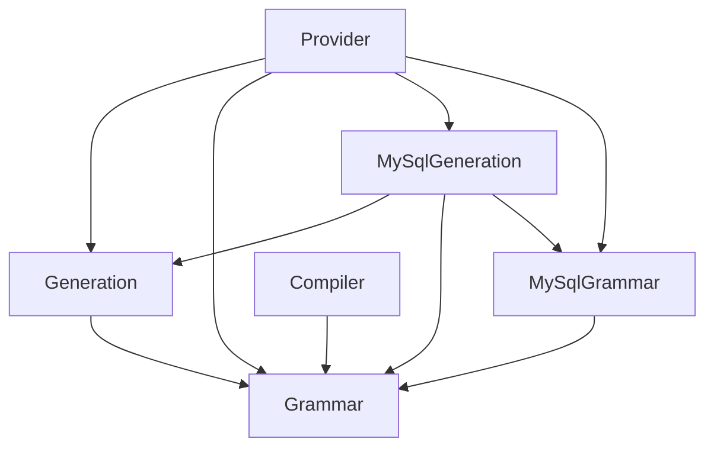

# SQL generation architecture

SQL Faker has three shared architectural stages. Each stage groups a major
responsibility in the algorithm; individual data structures and helper algorithms
remain implementation details within that stage.

| Stage | Responsibility | Allowed shared dependencies |
| --- | --- | --- |
| **Compiler** | Parse upstream Bison or Lemon sources and publish compiled grammar artifacts | Grammar |
| **Grammar** | Represent productions, symbols, supported releases and their compiled artifacts | None |
| **Generation** | Apply plans, derive terminals, rewrite token sequences, realize SQL and record what was generated | Grammar, Faker |

The Faker **Provider** layer is the composition boundary. It selects a database,
loads its grammar and constructs the shared engine with that database's generation
collaborators. PHP's runtime is available to compilation, grammar and generation.

## Shared concepts and database implementations

Each database has concrete Grammar and Generation layers corresponding to the
shared concepts:

| Shared layer | MySQL | PostgreSQL | SQLite |
| --- | --- | --- | --- |
| Grammar | MySqlGrammar | PostgreSqlGrammar | SqliteGrammar |
| Generation | MySqlGeneration | PostgreSqlGeneration | SqliteGeneration |

For example, `MySql\Grammar\MySqlGrammar` loads a release into the common
`Grammar\Model\Grammar`. `MySql\Generation\LexicalGrammar` implements the shared
`Generation\Lexeme\LexicalGrammar` contract. A concrete layer can depend on the
shared model or contract without requiring a matching inheritance hierarchy for
every class. Bison and Lemon are shared source formats, so Compiler has no
artificial database-specific layers.



This graph shows MySQL; PostgreSQL and SQLite have the same dependency directions.
Faker and PHP runtime edges are omitted. Provider can compose all three databases,
but database implementations cannot depend on each other. Shared stages cannot
depend on a database or Provider. Grammar cannot depend on Generation or Compiler,
and runtime generation cannot depend on Compiler.

## Source organization

```text
src/
  Compiler/
    Bison/                 Bison parsing and compilation
    Lemon/                 Lemon parsing and compilation
    Resource/              Compiled grammar publication
  Grammar/
    Model/                 Productions and symbols
    Resource/              Release registry and artifact locations
  Generation/
    Plan/, Choice/         Requested output and decision-driven planning
    Derivation/, Token/    Grammar traversal and structural rewrites
    Value/, Lexeme/        Lexical contracts and value domains
    Candidate/, Output/    Candidate resolution and SQL serialization
    Coverage/              Generation traces, measurements and persistence
  MySql/
    Grammar/               Release loading
    Generation/            Context, plans, lexemes, rewrites and tokenization
    StatementType.php      Public statement alias
  PostgreSql/              The same Grammar and Generation stages
  Sqlite/                  The same Grammar and Generation stages
  Provider/                Shared composition factory
  *Provider.php            Public Faker entry points
```

Subdirectories such as Plan, Derivation, Tokenization and Lookahead organize the
implementation without becoming architectural layers. Coverage belongs to
Generation because it observes derivation and lexical output. GrammarWriter and
ArtifactDirectory belong to Compiler because they publish build artifacts.
Generation's source revision digest continues to include every PHP file under
`src`, including database implementations.

Public Provider names, methods and `StatementType` aliases retain their signatures.
The internal coverage classes move from `SqlFaker\Coverage` to
`SqlFaker\Generation\Coverage`. Database contexts, plan presets, lexical grammars,
statement enums, tokenizers and lookahead implementations live under each
`SqlFaker\<Database>\Generation` namespace. Build commands, tests, benchmarks and
fuzz targets use the corresponding new names. Serialized grammar model names and
committed grammar artifacts are unchanged.

## Architecture checks

`composer deptrac` checks allowed dependencies and rejects production classes
outside the declared layers. `composer deptrac:debug` also reports unused allowed
dependencies; `composer lint` runs these checks alongside the package's other
guards. The configuration has no baseline, skipped violations or catch-all layer.

Production classes are collected by stage directory. Deptrac also treats PHPDoc
type aliases and `StatementType` class aliases as dependencies, so those names
are explicitly assigned to their declaring stage or the public Provider boundary.
